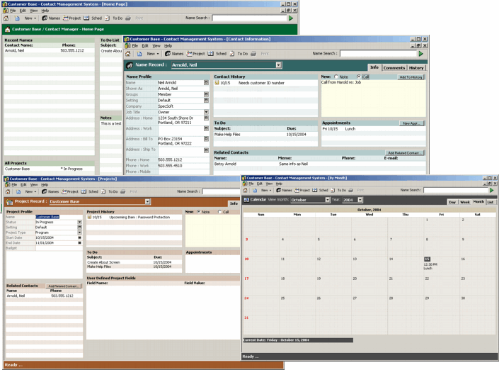



## Customer Base

### Description

UPDATED - 11/10/04

This is a Contact Management System for all those who would like to track Contacts, Projects, Appointments, and much more. A few of the features are: 1)Contact Management, 2)Project Management, 3)Appointment views by Month, Week, or Day, 4)Notes & Calls management, 5)To Do item management, 6)Various database utilities - compact, repair, backup, restore 7)Popup To Do & Appointment reminders 8) Query Contact & Project user defined fields.

View "ReadMe" for specific update features.
 
### More Info
 
See included Help files

None known

             |
---                |---
**Submitted On**   |2004-11-10 09:08:34
**By**             |[Neil Arnold](https://github.com/Planet-Source-Code/PSCIndex/blob/master/ByAuthor/neil-arnold.md)
**Level**          |Intermediate
**User Rating**    |4.9 (487 globes from 99 users)
**Compatibility**  |VB 6\.0
**Category**       |[Databases/ Data Access/ DAO/ ADO](https://github.com/Planet-Source-Code/PSCIndex/blob/master/ByCategory/databases-data-access-dao-ado__1-6.md)
**World**          |[Visual Basic](https://github.com/Planet-Source-Code/PSCIndex/blob/master/ByWorld/visual-basic.md)
**Archive File**   |[Customer\_B18168911102004\.zip](https://github.com/Planet-Source-Code/neil-arnold-customer-base__1-56865/archive/master.zip)

### API Declarations

Some in module - modAPI

